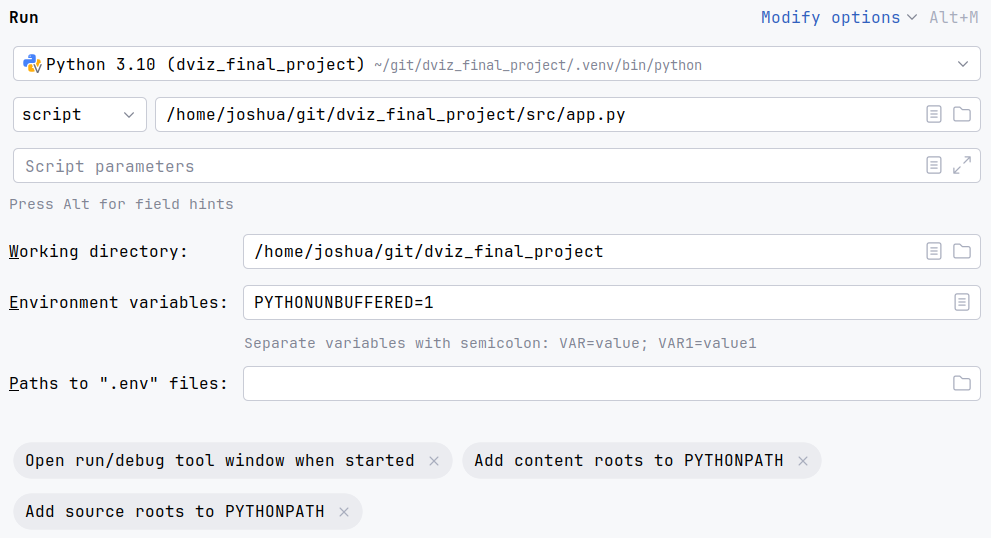
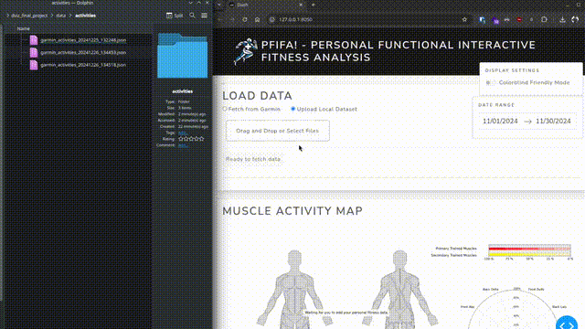
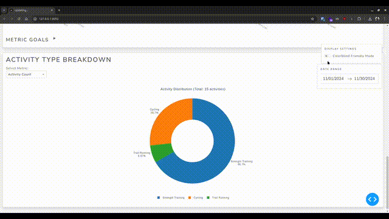
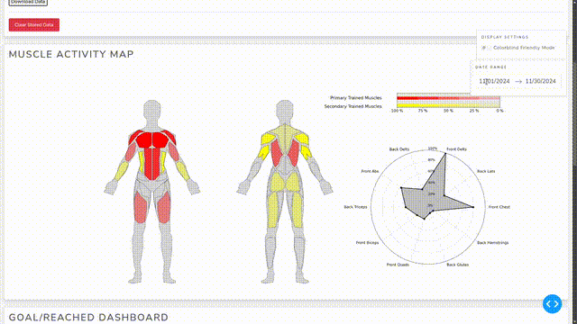
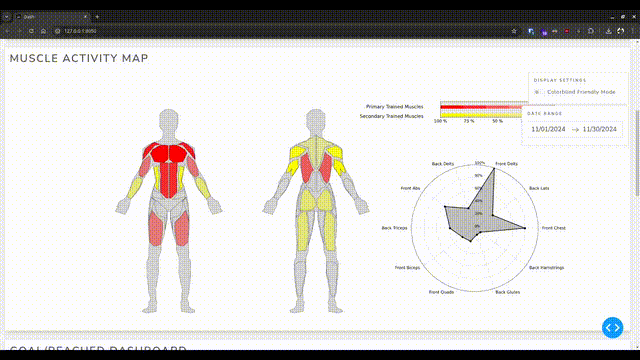
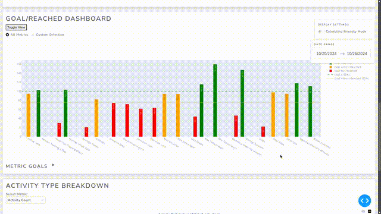
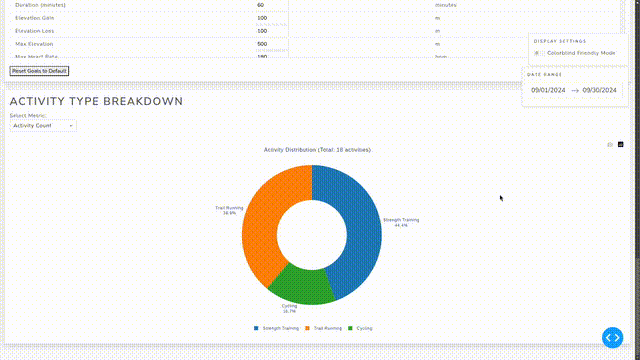

# PFIFA! (Personal Functional Interactive Fitness Analysis)

## About
PFIFA is an interactive fitness dashboard designed to display your personal progress tailored to your fitness goals. The data is gathered through Garmin fitness watches and visualized using Plotly and Dash, offering a dynamic and engaging user experience.

---

## Setup and Requirements

### Python Installation
To run this dashboard, you need a functioning Python installation on your operating system. You can download Python here: [Python Downloads](https://www.python.org/downloads/).

### Python Environment
We strongly recommend using a virtual environment to keep dependencies isolated from other projects. For guidance, refer to this primer on virtual environments: [Python Virtual Environments](https://realpython.com/python-virtual-environments-a-primer/).

### Python Packages
Ensure the required Python packages are installed. Run the following command from the project root:
```bash
pip install -r requirements.txt
```

---

## Running the App
Once the setup is complete and all dependencies are installed, you can launch the app by running the `app.py` file with Python. 

### Terminal
Use the following command in the project root, preferably within the virtual environment:
```bash
python3 ./src/app.py
```
Ensure the script is executed from the project root to maintain correct path references.

### IDE Run Button
If you want to run it with a run button in an IDE, make sure that the run configuration is correctly configured. For example:


---

## App Usage
The app features four primary sections: **Load Data**, and three visualizations: **Muscle Activity Map**, **Goal/Reached Dashboard**, and **Activity Type Breakdown**.

### Load Data
#### Fetch from Garmin
- Use your Garmin account credentials to fetch fitness data via the Garmin API.
- Due to API traffic regulation, data fetched will persist within the app.
- You can download your data for offline use or to minimize API usage on other devices.

#### Upload Local Dataset

- Upload previously downloaded datasets via the "Upload Local Dataset" section.
##### Example data
There is example data to use in the `data/activities` directory

### Toggle Colorblind Mode

- A floating toggle button enables a colorblind-friendly mode for better accessibility.
- Although the coloring scheme in this mode may appear less intuitive, it ensures clear distinction for users with colorblindness.

### Set Time Range

- Use the time range selector to adjust the period for visualizations. If no data is available for the selected range, a message will appear within the visualization.

---

## Visualizations

### Muscle Activity Map

#### Muscle Map
- Displays trained muscle groups with color-coded intensity:
    - Primary muscles: **Red** (or **Blue** in colorblind mode).
    - Secondary muscles: **Yellow** (or **Turquoise** in colorblind mode).
- Opacity indicates training intensity, with higher opacity representing more training.

#### Spider Chart
- Complements the Muscle Map by visualizing training balance as a spider chart.
- Helps analyze the balance of your strength training in a direct, graphical manner.

### Goal/Reached Dashboard

Allows you to set and track goals for various metrics measured by your Garmin watch.

#### Summary View
- Compares metrics in a summarized bar chart.
- Toggle between all metrics or a customized selection.

#### Single Metric View
- Focus on a single metric over time.
- Displays individual training sessions within the selected period and indicates whether goals were met.
- Set individual metric goals directly within this view.

#### Metric Selection Table
- Use the unfoldable table to set goals for various metrics, affecting both summary and single metric goals.

### Activity Type Breakdown

- Displays a pie chart of your training types.
- Customize the metrics displayed (e.g., duration, number of activities).

---

PFIFA combines functionality and interactivity to give you an in-depth analysis of your fitness journey. Happy tracking!